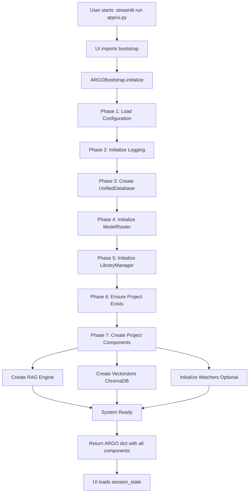
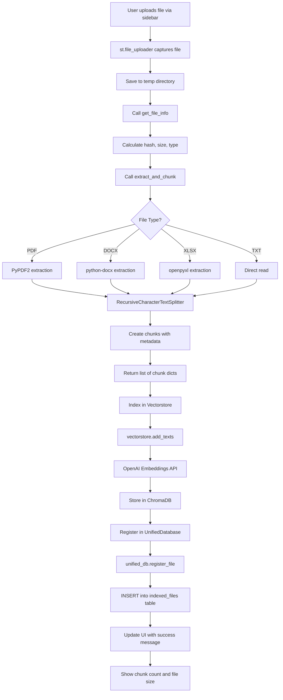
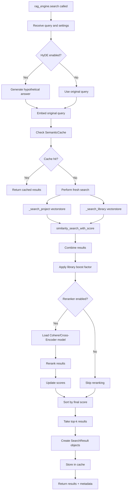
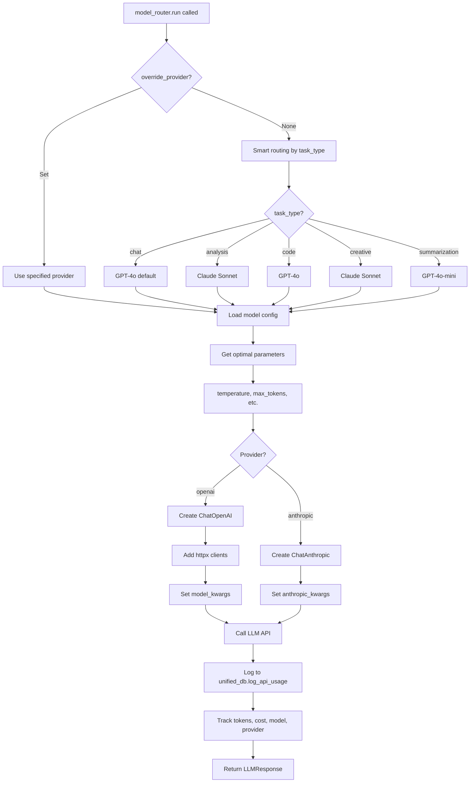
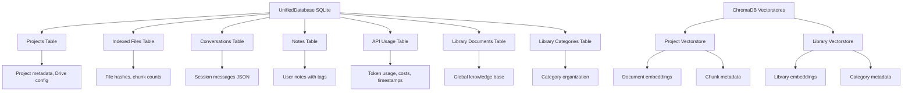
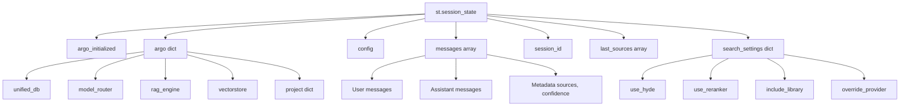
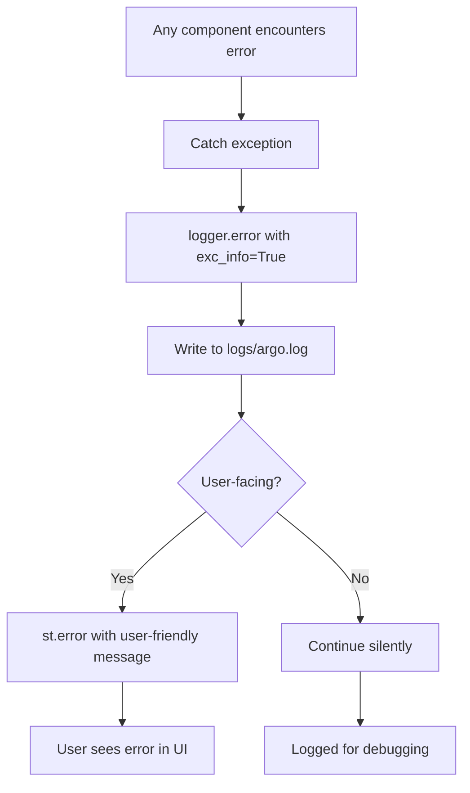

# ARGO v9.0 - Architecture & Data Flow

## Overview

ARGO v9.0 is an Enterprise PMO Platform built with Clean Architecture principles, featuring unified data management, intelligent RAG (Retrieval-Augmented Generation), and multi-model LLM routing.

---

## System Components

### Core Layer
- **bootstrap.py** - System initialization orchestrator
- **config.py** - Configuration management
- **unified_database.py** - Single source of truth for all data
- **model_router.py** - Intelligent LLM routing (GPT-4 ↔ Claude)
- **llm_provider.py** - OpenAI & Anthropic client management
- **rag_engine.py** - Advanced RAG with HyDE + Reranking
- **library_manager.py** - Global knowledge library
- **logger.py** - Centralized logging

### Application Layer
- **app/ui.py** - Streamlit professional UI
- **app/panels/analytics_panel.py** - Analytics dashboard

### Tools Layer
- **tools/extractors.py** - Document text extraction (PDF, DOCX, XLSX, etc.)
- **tools/google_drive_sync.py** - Google Drive integration

---

## 1. System Initialization Flow



**Key Objects Created:**
- `config` - Configuration manager
- `unified_db` - SQLite database with all tables
- `model_router` - LLM routing intelligence
- `vectorstore` - ChromaDB for embeddings (per project)
- `rag_engine` - RAG search orchestrator
- `library_manager` - Global knowledge base

---

## 2. User Query Flow (Complete End-to-End)

```mermaid
graph TD
    A[User types message in Chat] --> B[st.chat_input captures prompt]
    B --> C[Append to session_state.messages]
    C --> D[Get search_settings from sidebar]
    D --> E[Call rag_engine.search]

    E --> F[RAG Engine Processing]
    F --> G{use_hyde enabled?}
    G -->|Yes| H[Generate hypothetical document]
    G -->|No| I[Use original query]
    H --> I

    I --> J[Search Project Vectorstore]
    I --> K[Search Library Vectorstore]

    J --> L[Get top-k results with scores]
    K --> L

    L --> M{use_reranker enabled?}
    M -->|Yes| N[Rerank results by relevance]
    M -->|No| O[Use original scores]
    N --> O

    O --> P[Format context from results]
    P --> Q[Update st.session_state.last_sources]

    Q --> R[Build system prompt with context]
    R --> S[Prepare messages array]
    S --> T[Call model_router.run]

    T --> U{override_provider set?}
    U -->|Yes| V[Use specified provider]
    U -->|No| W[Smart routing by task_type]

    V --> X[Select model and parameters]
    W --> X

    X --> Y{Provider?}
    Y -->|openai| Z[ChatOpenAI with httpx clients]
    Y -->|anthropic| AA[ChatAnthropic]

    Z --> AB[Call OpenAI API]
    AA --> AC[Call Anthropic API]

    AB --> AD[Log API usage to unified_db]
    AC --> AD

    AD --> AE[Return LLMResponse object]
    AE --> AF[Extract response.content]

    AF --> AG[Calculate confidence score]
    AG --> AH[Extract sources metadata]
    AH --> AI[Display response in chat]

    AI --> AJ[Append assistant message to session_state]
    AJ --> AK[Auto-save conversation to unified_db]
    AK --> AL[Update Active Sources panel]
    AL --> AM[Show confidence indicator]
    AM --> AN[Display feedback buttons]
```



---

## 3. Document Upload & Indexing Flow



---

## 4. RAG Search Deep Dive



---

## 5. Model Routing Logic



---

## 6. Data Storage Architecture



---

## 7. UI State Management



---

## 8. Complete Request-Response Cycle

### Step-by-Step Flow

#### **1. Initialization (Once per session)**
```
User → streamlit run app/ui.py
  ↓
UI checks st.session_state.argo_initialized
  ↓
ARGOBootstrap.initialize() called
  ↓
Configuration loaded from config.yaml + .env
  ↓
UnifiedDatabase created (SQLite)
  ↓
ModelRouter initialized (GPT-4 + Claude)
  ↓
Project loaded/created
  ↓
Vectorstore created (ChromaDB)
  ↓
RAG Engine initialized
  ↓
All components stored in st.session_state.argo
  ↓
UI renders with sidebar + main area
```

#### **2. User Query (Each message)**
```
User types "What is the project budget?"
  ↓
UI appends {'role': 'user', 'content': '...'} to messages
  ↓
Gets search_settings from sidebar
  ↓
Calls rag_engine.search(query, settings)
  ↓
RAG Engine:
  - Generates HyDE hypothetical (if enabled)
  - Embeds query → OpenAI Embeddings API
  - Searches project vectorstore (ChromaDB)
  - Searches library vectorstore (ChromaDB)
  - Reranks results (if enabled)
  - Returns top 5 SearchResult objects
  ↓
UI stores sources in st.session_state.last_sources
  ↓
Formats context from results
  ↓
Builds system prompt with context
  ↓
Calls model_router.run(messages, override_provider)
  ↓
ModelRouter:
  - Checks override_provider (from sidebar)
  - If None, routes by task_type (chat → GPT-4)
  - Creates ChatOpenAI with httpx clients
  - Calls OpenAI API
  - Logs usage to unified_db
  - Returns LLMResponse
  ↓
UI displays response
  ↓
Calculates confidence score
  ↓
Shows sources in expander
  ↓
Shows confidence indicator (High/Med/Low)
  ↓
Shows feedback buttons (Helpful/Not Helpful)
  ↓
Appends assistant message to messages
  ↓
Auto-saves conversation to unified_db
  ↓
Updates Active Sources panel in sidebar
```

#### **3. Document Upload**
```
User uploads document.pdf
  ↓
UI saves to temp directory
  ↓
Calls get_file_info() → hash, size, type
  ↓
Calls extract_and_chunk()
  ↓
Extractor:
  - Detects PDF type
  - Uses PyPDF2 to extract text
  - Splits into chunks (RecursiveCharacterTextSplitter)
  - Returns list of {content, metadata} dicts
  ↓
UI indexes in vectorstore:
  - Calls vectorstore.add_texts(texts, metadatas)
  - OpenAI Embeddings API called for each chunk
  - Embeddings stored in ChromaDB
  ↓
UI registers in database:
  - Calls unified_db.register_file()
  - INSERT into indexed_files table
  ↓
UI shows success message with chunk count
```

#### **4. Conversation Management**
```
User clicks "Save" button
  ↓
UI calls unified_db.save_conversation(
    project_id,
    session_id,
    messages array
)
  ↓
UnifiedDatabase:
  - Serializes messages to JSON
  - INSERT/UPDATE conversations table
  ↓
UI shows "Conversation saved" message

User clicks "New Chat"
  ↓
UI generates new session_id
  ↓
Clears st.session_state.messages
  ↓
Reloads UI with empty chat

User clicks "Load" on previous conversation
  ↓
UI calls unified_db.load_conversation(project_id, session_id)
  ↓
UnifiedDatabase:
  - SELECT messages_json from conversations
  - Deserialize JSON to list
  ↓
UI sets st.session_state.messages = loaded_messages
  ↓
UI reruns, showing old conversation
```

#### **5. Notes Management**
```
User creates note
  ↓
UI calls unified_db.save_note(project_id, title, content, tags)
  ↓
UnifiedDatabase:
  - INSERT into notes table
  ↓
UI reloads, shows note in sidebar

User deletes note
  ↓
UI calls unified_db.delete_note(note_id)
  ↓
UnifiedDatabase:
  - DELETE from notes WHERE id = ?
  ↓
UI reloads, note removed
```

---

## 9. External API Integrations

### OpenAI API
- **Used for:**
  - Embeddings (text-embedding-3-small)
  - Chat completion (gpt-4o, gpt-4o-mini)
- **Authentication:** API key in .env
- **Custom httpx clients:** Bypass proxy issues
- **Rate limiting:** Handled by provider
- **Cost tracking:** Logged to unified_db.api_usage

### Anthropic API
- **Used for:**
  - Chat completion (claude-3-5-sonnet)
- **Authentication:** API key in .env
- **Use cases:** Analysis, creative tasks
- **Cost tracking:** Logged to unified_db.api_usage

### Google Drive API (Optional)
- **Used for:**
  - Document sync
- **Authentication:** service_account credentials JSON
- **Sync direction:** Bidirectional
- **Status:** UI placeholder (requires google_drive_sync.py)

---

## 10. Error Handling & Logging



**Log Levels:**
- DEBUG: Detailed flow information
- INFO: System initialization, query processing
- WARNING: Non-critical issues (missing features)
- ERROR: Failures with stack traces
- CRITICAL: System-breaking errors

**Log Files:**
- `logs/argo.log` - Main application log
- `logs/rag_engine.log` - RAG search operations
- `logs/model_router.log` - LLM routing decisions
- `logs/unified_database.log` - Database operations

---

## 11. Performance Optimizations

### Caching
- **SemanticCache:** RAG search results (24h TTL)
- **Streamlit @st.cache_data:** UI data loading
- **Vectorstore persistence:** ChromaDB on disk

### Database
- **Indexes:** project_id, session_id, created_at
- **Prepared statements:** SQL injection prevention
- **Connection pooling:** Single database file

### API Efficiency
- **Batch embeddings:** Multiple chunks at once
- **Smart routing:** Cheaper models for simple tasks
- **Token limits:** Configurable max_tokens

---

## 12. Security Considerations

### Secrets Management
- ✅ API keys in `.env` (gitignored)
- ✅ Google credentials in `google_credentials.json` (gitignored)
- ✅ No secrets in code
- ✅ Environment variable validation

### Data Security
- ✅ SQLite file permissions
- ✅ No SQL injection (parameterized queries)
- ✅ File upload validation (type, size)
- ✅ Hash-based deduplication

### API Security
- ✅ Custom httpx clients (controlled proxies)
- ✅ Timeout limits (60s)
- ✅ Rate limiting awareness
- ✅ Error handling (no key exposure)

---

## 13. Deployment Architecture

```
ARGO v9.0 Deployment

┌─────────────────────────────────────────────┐
│         User's Local Machine                │
│                                             │
│  ┌───────────────────────────────────────┐ │
│  │   Streamlit UI (Port 8501)            │ │
│  │   - Professional corporate interface  │ │
│  │   - Sidebar with all controls         │ │
│  │   - Chat, Documents, Analytics tabs   │ │
│  └───────────────┬───────────────────────┘ │
│                  │                           │
│  ┌───────────────▼───────────────────────┐ │
│  │   ARGO Bootstrap & Core               │ │
│  │   - ModelRouter                       │ │
│  │   - RAG Engine                        │ │
│  │   - UnifiedDatabase                   │ │
│  │   - LibraryManager                    │ │
│  └───────┬───────────────┬───────────────┘ │
│          │               │                   │
│  ┌───────▼──────┐ ┌─────▼──────────────┐   │
│  │  SQLite DB   │ │  ChromaDB          │   │
│  │  - Projects  │ │  - Embeddings      │   │
│  │  - Files     │ │  - Vectors         │   │
│  │  - Notes     │ │  - Metadata        │   │
│  │  - Convos    │ │                    │   │
│  │  - API Usage │ │                    │   │
│  └──────────────┘ └────────────────────┘   │
└─────────────┬───────────────┬───────────────┘
              │               │
      ┌───────▼─────┐  ┌──────▼─────────┐
      │  OpenAI API │  │ Anthropic API  │
      │  - GPT-4o   │  │ - Claude 3.5   │
      │  - Embeddings│ │                │
      └─────────────┘  └────────────────┘
              │
      ┌───────▼──────────┐
      │  Google Drive    │
      │  (Optional sync) │
      └──────────────────┘
```

---

## 14. Technology Stack

### Backend
- **Python 3.10+**
- **LangChain** - LLM orchestration
- **OpenAI SDK** - GPT-4 integration
- **Anthropic SDK** - Claude integration
- **ChromaDB** - Vector database
- **SQLite** - Relational database
- **httpx** - Custom HTTP clients

### Frontend
- **Streamlit** - Web UI framework
- **Plotly** - Interactive charts
- **Pandas** - Data manipulation

### Document Processing
- **PyPDF2** - PDF extraction
- **python-docx** - Word documents
- **openpyxl** - Excel files
- **Markdown** - MD files

### Utilities
- **python-dotenv** - Environment variables
- **PyYAML** - Configuration files
- **hashlib** - File hashing

---

## 15. Key Design Patterns

### Clean Architecture
- **Separation of concerns:** Core, App, Tools layers
- **Dependency inversion:** Core doesn't depend on UI
- **Single responsibility:** Each module has one job

### Repository Pattern
- **UnifiedDatabase:** Single data access layer
- **Abstraction:** Business logic doesn't know SQLite details

### Strategy Pattern
- **ModelRouter:** Different routing strategies per task
- **Extractors:** Different extraction strategies per file type

### Factory Pattern
- **ARGOBootstrap:** Creates all system components
- **Model initialization:** Creates correct LLM client

### Observer Pattern
- **Watchers:** Monitor file system changes (optional)
- **Logging:** Centralized event tracking

---

## Summary

**ARGO v9.0 follows a clean, layered architecture:**

1. **User interacts with UI** → Streamlit professional interface
2. **UI calls Core modules** → Bootstrap, RAG, Router, Database
3. **Core processes requests** → Search, route, store
4. **External APIs queried** → OpenAI, Anthropic, Google Drive
5. **Results stored locally** → SQLite + ChromaDB
6. **Response returned to UI** → Formatted, with metadata
7. **User sees professional output** → Chat, sources, confidence, feedback

**Key strengths:**
- ✅ Single database (UnifiedDatabase)
- ✅ Intelligent routing (ModelRouter)
- ✅ Advanced RAG (HyDE + Reranking)
- ✅ Professional UI (No emojis, corporate CSS)
- ✅ Complete feature set (Conversations, Notes, Sources, Analytics)
- ✅ Clean architecture (Easy to extend)

**Current limitations:**
- Google Drive sync is placeholder (needs implementation)
- Web search not implemented
- Vision analysis not implemented
- Proactive suggestions not implemented

All data flows are logged, tracked, and stored for full transparency and auditability.
